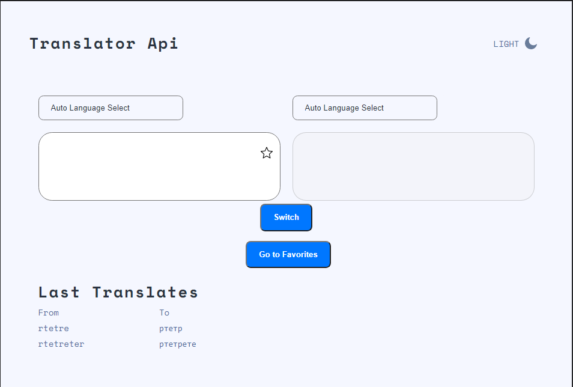

# Translator API

## Your users should be able to:

- Smart Translate
- Loader
- Notification About Language
- Automatic language understanding
- Added Words in Favorites
- Switch Themes
- Switch Languages
- Last Translates

## [Github Pages](https://ealsycod.github.io/TranslatorApi/#/)

## Usage

`npm i`

`npm run start`

### Coded by [ealsyCoD](https://github.com/EalsyCoD)
